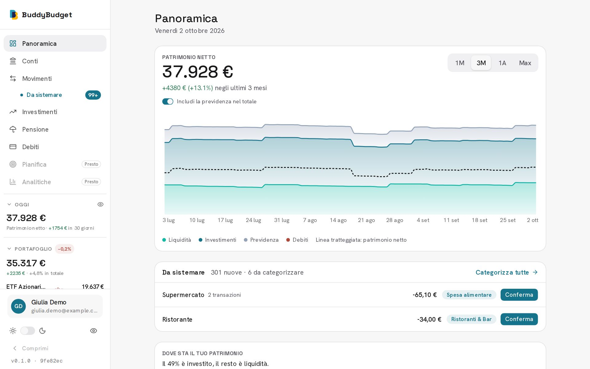
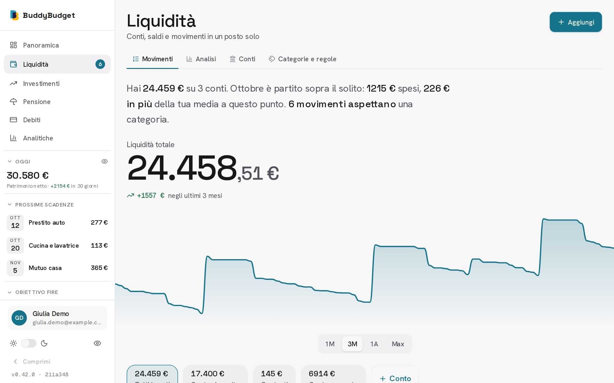
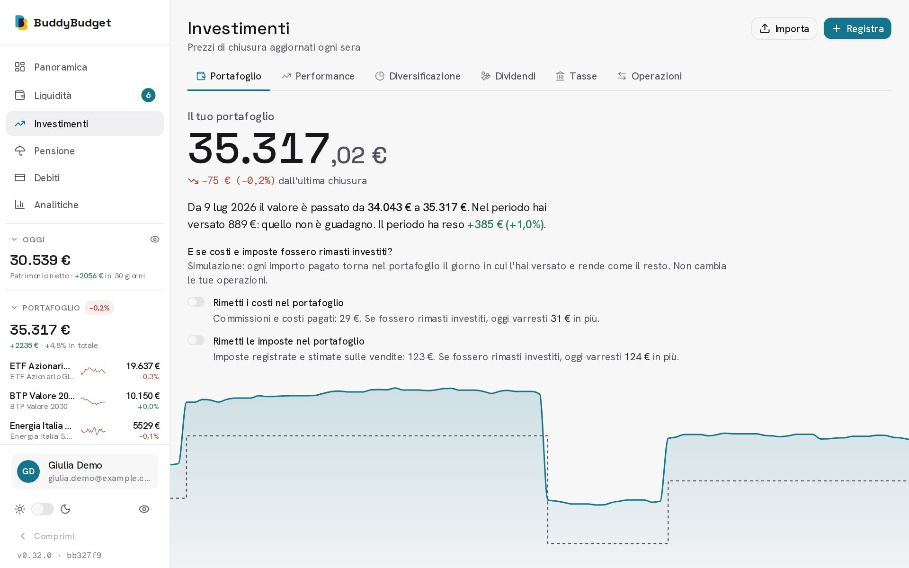
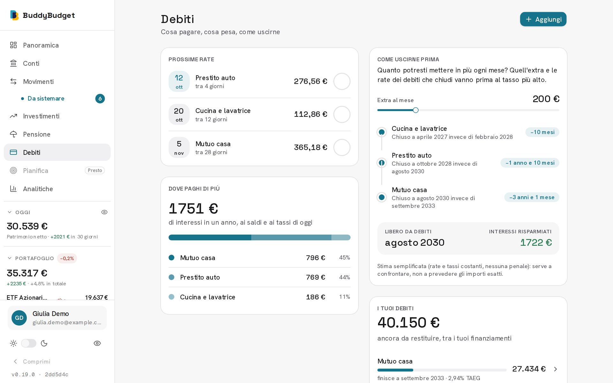

# BuddyBudget

App di finanza personale: conti, movimenti e budget, investimenti con fiscalità italiana, debiti e pensione, in un'unica vista sul patrimonio netto. Lingua e valuta si scelgono in onboarding (oggi l'interfaccia è solo in italiano, vedi [Stato](#stato-del-progetto)).

> **English:** BuddyBudget is a personal finance web app (accounts, transactions and budgets, investments with Italian tax rules, debts, pension, net worth over time). The UI and most of the documentation are in Italian. A short English summary is at the [bottom](#english-summary).

| Panoramica | Movimenti |
| --- | --- |
|  |  |
| **Investimenti** | **Debiti** |
|  |  |

Gli screenshot sono dell'app vera con dati di esempio (utente fittizio), nel tema chiaro; esiste anche il tema scuro (`landing/public/screens/dark/`). L'elenco completo delle schermate è in [`landing/content/screens.ts`](landing/content/screens.ts) e il modo in cui vengono generate in [`docs/landing-screens.md`](docs/landing-screens.md).

## Cosa fa

- **Panoramica**: patrimonio netto nel tempo, ripartito tra liquidità, investimenti, previdenza e debiti.
- **Conti**: conti manuali e collegamento alla banca via Open Banking ([GoCardless Bank Account Data](https://bankaccountdata.gocardless.com)), con sincronizzazione periodica e manuale.
- **Movimenti**: elenco con ricerca e filtri, categorie in quattro gruppi di spesa (Dovute, Volute, Te futuro, Saltuarie), budget per categoria, analisi e cash flow, categorizzazione a regole visibili (nessuna categoria viene applicata senza una regola esplicita).
- **Investimenti**: ETF, azioni, BTP, fondi e crypto con prezzi di fine giornata da fonti gratuite; operazioni, PAC, import CSV; rendimento reale e confronto con un indice, rischio e diversificazione, proventi, **fiscalità italiana** (plus/minus, zainetto fiscale, titoli di Stato, bollo), titoli con watchlist e avvisi di prezzo.
- **Debiti**: finanziamenti con piano di ammortamento, TAEG, estinzioni anticipate, linea Lombard, simulatore (surroga, valanga, palla di neve).
- **Pensione**: fondo pensione e TFR, rendimento reale, stima del prelievo oggi al netto delle tasse e proiezione. Le regole fiscali sono ipotesi non ancora validate da un professionista.
- **Account**: accesso con link via email o Google, esportazione dei dati in ZIP, azzeramento ed eliminazione con 30 giorni di ripensamento, PWA installabile, tema chiaro e scuro.

Le stime fiscali e finanziarie sono a scopo informativo e non costituiscono consulenza. L'elenco aggiornato (con ciò che è in arrivo) è in [`lib/features/catalog.ts`](lib/features/catalog.ts).

## Stack

- Next.js (App Router) e TypeScript, React 19
- Tailwind CSS v4 e shadcn/ui (su `@base-ui/react`), grafici con Recharts
- Postgres con Drizzle ORM, migration versionate in `lib/db/migrations/`
- better-auth (magic link e Google OAuth), email transazionali con Resend
- TanStack Query lato client; Route Handlers come API (niente Server Actions)
- Redis per rate limiting, stato dei job in background e cache
- Osservabilità: log JSON, metriche Prometheus (`/api/metrics`), eventi di prodotto con Umami
- Test con Vitest; CI su GitHub Actions

## Struttura del repository

```
app/            route Next.js: (auth), (app) con le schermate, api/ (route handler e cron)
components/     ui/ (primitive), layout/ (struttura pagina), domain/ (componenti per feature)
lib/            logica di dominio per area; calc/ contiene i motori di calcolo puri e testati
lib/db/         schema Drizzle e migration
landing/        sito vetrina statico (progetto Next.js separato, con propri package.json e CI)
scripts/        seed dei dati demo e sonde
docs/           visione, specifiche, decision log, spec e piani di ogni feature
```

I componenti sono su tre layer con dipendenze solo verso il basso (`ui` ← `layout`/`domain` ← `app`). Le regole di architettura, osservabilità e design token sono in [`CLAUDE.md`](CLAUDE.md), che è anche la guida per l'assistente di sviluppo usato nel progetto.

## Avvio in locale

Servono Node 24, [pnpm](https://pnpm.io), Postgres e Redis.

```bash
pnpm install
cp .env.local.example .env.local   # poi compila i valori
pnpm db:migrate                    # applica le migration
pnpm dev                           # http://localhost:3000
```

In `.env.local` sono obbligatorie (lo schema in [`lib/env.ts`](lib/env.ts) le valida all'avvio) le variabili di database, Redis, better-auth, Google OAuth, Resend, GoCardless e `CRON_SECRET`; per lo sviluppo bastano credenziali di sandbox o valori segnaposto se non usi quella funzione. Sono opzionali Ollama (categorizzazione assistita), le chiavi delle fonti di prezzo e le variabili di osservabilità. Ogni variabile è commentata in [`.env.local.example`](.env.local.example).

Per provare l'app con dati di esempio: `pnpm demo:seed` crea in un database vuoto un utente fittizio con conti, movimenti, investimenti e debiti.

### Comandi

```bash
pnpm lint         # ESLint
pnpm test         # Vitest (usa DATABASE_URL: un database vuoto e migrato)
pnpm build        # build di produzione
pnpm db:generate  # nuova migration dopo una modifica a lib/db/schema
```

Lo schema del database cambia solo tramite migration versionate (`pnpm db:generate`, poi `pnpm db:migrate`).

## Deploy

L'immagine Docker si costruisce con `docker build -t buddy-budget:local .` (target `migrator` per le migration). In produzione l'app gira su un cluster k3s con GitOps (ArgoCD), gestito nel repository di infrastruttura separato `buddy-budget-infra`. Il codice non dipende da quell'infrastruttura: i cron sono endpoint `/api/cron/*` chiamati con `CRON_SECRET`.

## Documentazione

- [`docs/decision-log.md`](docs/decision-log.md): perché sono state prese le decisioni, in ordine di data
- [`docs/product-vision.md`](docs/product-vision.md) e [`docs/functional-spec.md`](docs/functional-spec.md): visione e specifica per schermata
- [`docs/superpowers/specs/`](docs/superpowers/specs) e [`plans/`](docs/superpowers/plans): spec e piani di ogni feature
- [`docs/landing-screens.md`](docs/landing-screens.md): come si generano gli screenshot
- [`landing/README.md`](landing/README.md): il sito vetrina

## Stato del progetto

Il progetto è in sviluppo attivo da una persona sola, con l'aiuto di un assistente AI per il codice. Non c'è ancora un sistema di traduzione: l'italiano è la lingua dell'interfaccia e della documentazione. Non sono implementate le schermate Pianifica e Analitiche. Lo stato aggiornato è in [`CLAUDE.md`](CLAUDE.md), sezione "Stato del progetto".

## Contribuire e sicurezza

Vedi [`CONTRIBUTING.md`](CONTRIBUTING.md) e il [Codice di condotta](CODE_OF_CONDUCT.md). Per segnalare una vulnerabilità, non aprire una issue pubblica: leggi [`SECURITY.md`](SECURITY.md).

## English summary

BuddyBudget is a personal finance app built with Next.js, Postgres (Drizzle) and Redis. It covers manual and Open Banking accounts, categorised transactions with budgets, investment tracking (returns, risk, diversification, Italian capital-gains tax estimates), debts with amortisation and simulators, pension funds, and net worth over time. The interface and most docs are currently in Italian; language and currency are chosen at onboarding but only Italian/EUR is implemented.

To run it locally you need Node 24, pnpm, Postgres and Redis: `pnpm install`, copy `.env.local.example` to `.env.local` and fill it in (Google, Resend and GoCardless values are validated at startup), `pnpm db:migrate`, `pnpm dev`. Tax and financial figures are informational estimates, not advice.

## Licenza

[GNU Affero General Public License v3.0](LICENSE) (AGPL-3.0-only). In sintesi: puoi usare, studiare, modificare e ridistribuire il codice, ma se offri una versione modificata come servizio in rete devi rendere disponibile il codice sorgente agli utenti, con la stessa licenza. Resta l'obbligo di conservare le note di copyright e l'attribuzione all'autore originale indicate in [`NOTICE`](NOTICE).
