# Prova locale del CSV personale — 8 ottobre 2026

Account locale di verifica, export Trade Republic reale di 885 righe, caricato **come CSV generico** dalla pagina `/importazioni`. Screenshot con dati visibili pubblicati su richiesta esplicita del proprietario. Il CSV, le risposte del provider e le credenziali non sono inclusi nel repository.

## Esito

| Passaggio | Evidenza |
| --- | --- |
| Upload dal browser | Consenso, fonte personale, coda asincrona, stima di un'ora e orario previsto |
| Generazione reale | `deepseek/deepseek-v4.1-flash`, OpenRouter HTTP 200, `finish_reason=stop`, ZDR obbligatorio; tutte le 885 righe inviate |
| Worker | Analisi riuscita in circa 11 secondi; due esecuzioni isolate deterministiche |
| Confronto indipendente | 868 movimenti e 17 investimenti; zero esclusioni/errori; confronto riga per riga con l'importatore Trade Republic per importi, date, valute dei movimenti, quantità/prezzi/costi/imposte/tipo operazione e ISIN/tipo strumento |
| Conferma dal browser | 885 registrazioni di cassa (868 movimenti + 17 regolamenti investimento), 17 operazioni investimento, 885 ricevute; conto dedicato con saldo 975,64 €, uguale alla somma dei movimenti |
| Secondo upload e conferma | Stesso parser salvato, nessuna chiamata OpenRouter; conteggi e saldo invariati, entrambi i job importati |
| Pulizia | CSV cifrato eliminato dopo analisi, anteprima cifrata eliminata dopo conferma |
| Pagine finali | Pagamenti visibili nel conto dedicato; acquisti/vendite visibili in Investimenti → Operazioni |
| Email | Invio e retry verificati nei test automatici con provider simulato. **Consegna reale non verificata**: configurazione Resend locale rifiutata (HTTP 400); serve una configurazione valida per chiudere questo ultimo controllo |

Il database conteneva già il test dell'importatore Trade Republic nativo. I nuovi dati appartengono al conto `Trade Republic · E2E AI · CSV`; la deduplicazione è per formato personale, non tra importatori diversi.

## Correzioni trovate durante il test

- Il provider consumava il budget solo nel ragionamento, senza codice. Disabilitato il ragionamento opzionale DeepSeek, aumentato il budget di output a 32.768 e il timeout a 240 secondi; risposte troncate mostrate come errore esplicito.
- Rafforzate le istruzioni su cassa netta, imposte, premi e rimborsi: non scartare accrediti come presunti duplicati, non omettere rettifiche fiscali. Ammesse registrazioni a saldo zero.
- Evitati cutoff di data presi dal campione e algoritmi ISIN inventati; date e checksum verificati dal server.
- Distinte categorie generiche FUND dagli ETF identificabili tramite nome e identificativo.
- Errori del worker identificano la fase senza registrare CSV, codice generato o segreti.

Il codice del parser utilizzato nel test è stato generato dal modello, non corretto manualmente. La corrispondenza su questo file non garantisce la correttezza di ogni parser futuro: resta necessaria l'anteprima con conferma umana.

## Verifiche automatiche

21 test dedicati passati (18 contratto/sandbox/integrazione, 3 API); TypeScript ed ESLint dei file modificati passati. Build di produzione già verificata prima delle correzioni del worker; non ripetuta dopo queste correzioni. Le limitazioni della suite generale sono documentate nella PR.

## Screenshot

### Analisi e orario previsto
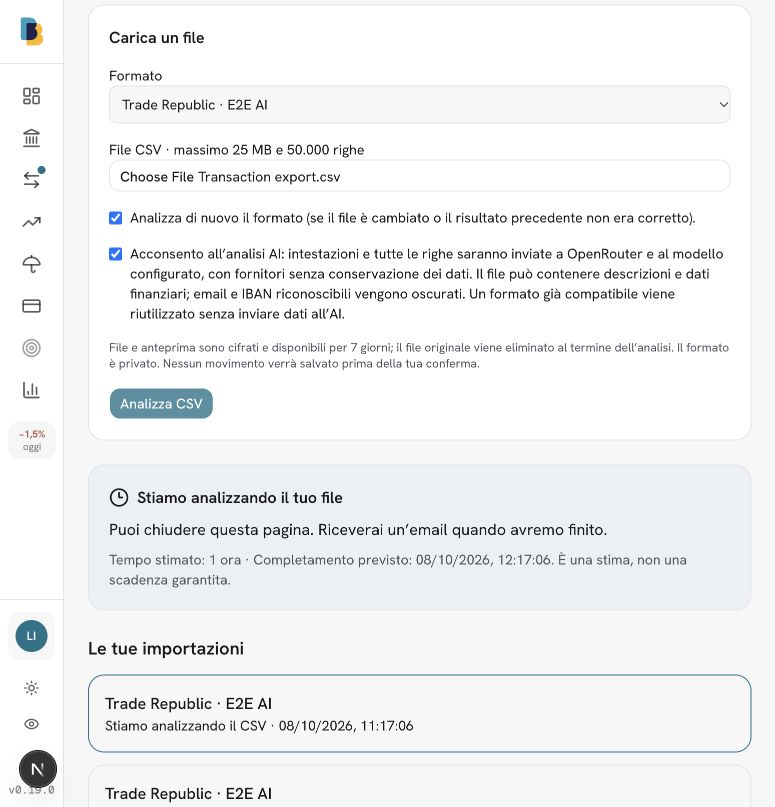

### Anteprima di tutte le 885 operazioni
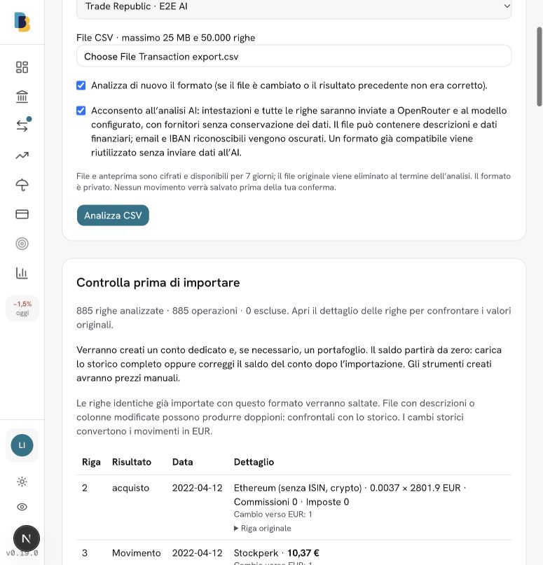

### Importazione completata
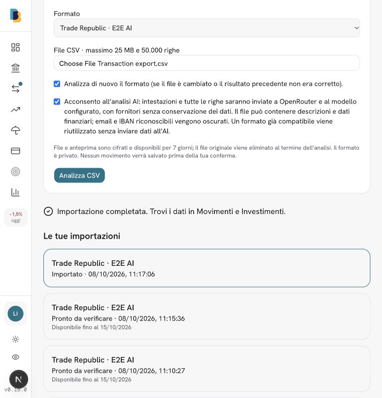

### Seconda importazione senza nuovi dati
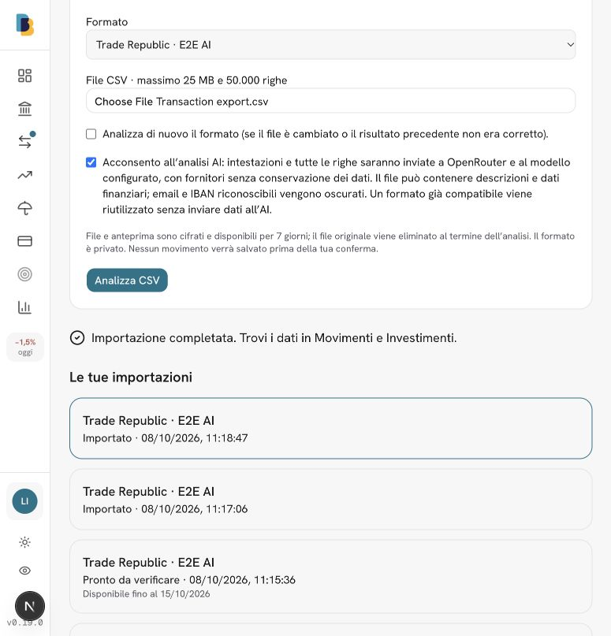

### Pagamenti del conto personale
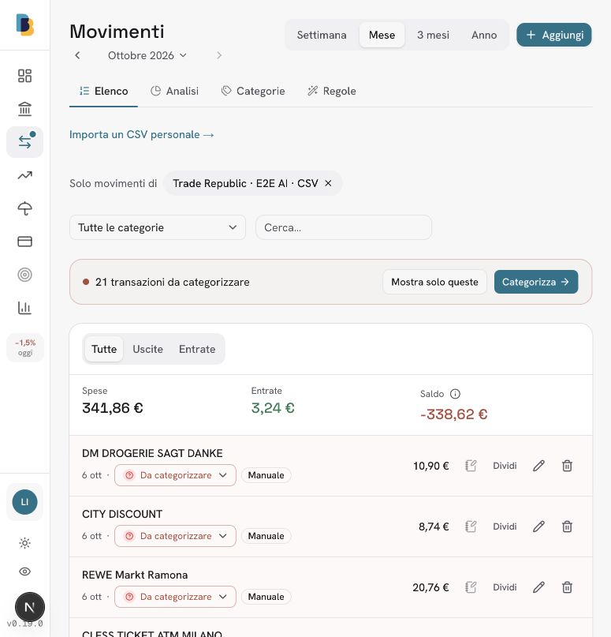

### Conto e saldo riconciliato
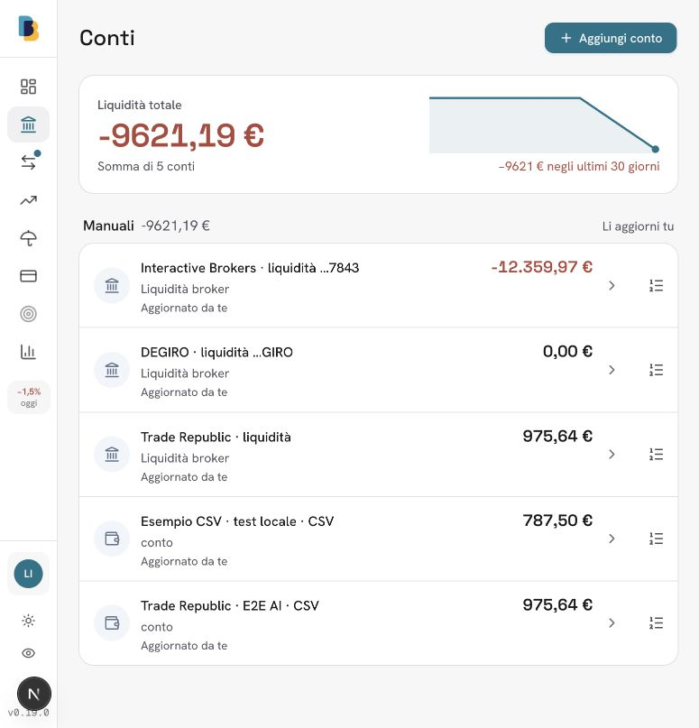

### Operazioni d'investimento
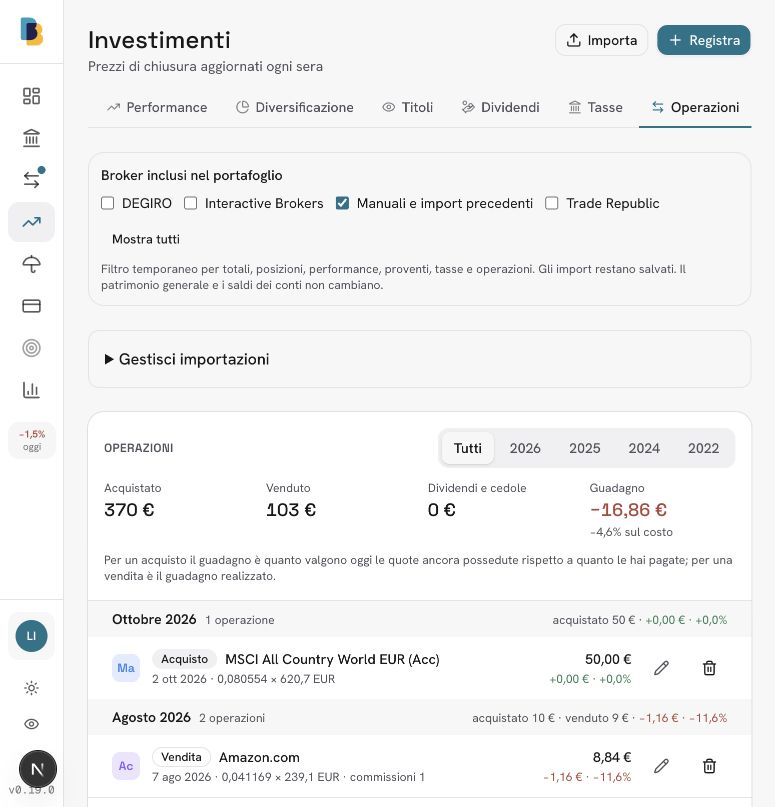

### CSV personali in Gestisci importazioni

Verificati elenco con fonte/stato/data e collegamento all'importazione corretta da Investimenti → Operazioni → Gestisci importazioni. TypeScript ed ESLint passati.

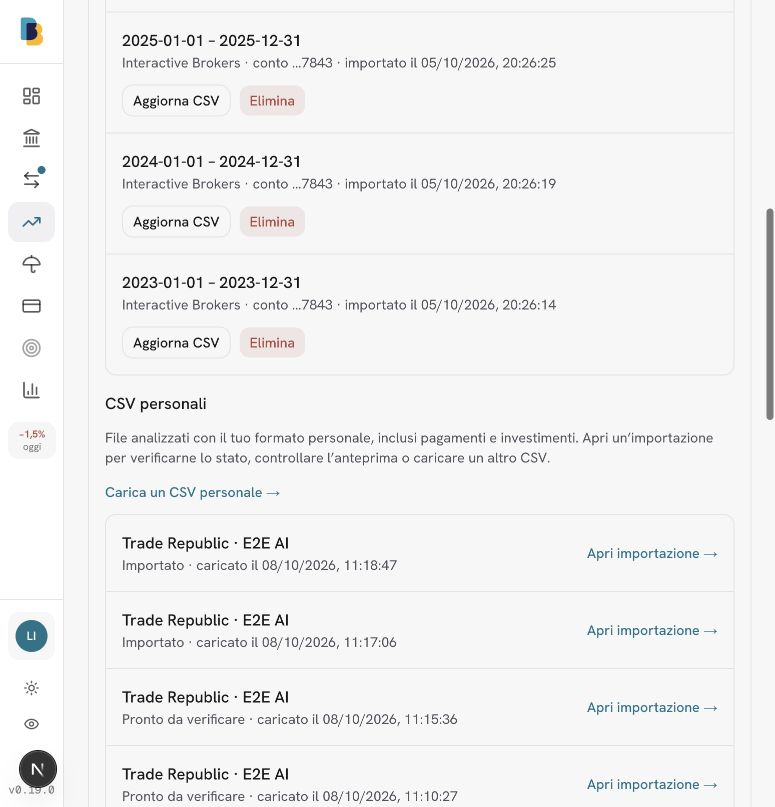

## Lista unificata e cancellazione per caricamento

La sezione CSV personali separata mostrata nello screenshot 08 è stata sostituita da un unico elenco cronologico con i rendiconti broker. I vecchi dati personali di prova locali sono stati rimossi su richiesta dell’utente; nessun percorso speciale di cancellazione per vecchi import è stato aggiunto.

26 test dedicati passati: inclusi cancellazione del singolo caricamento, conservazione degli upload successivi e dei parser, reimportazione, doppioni, autorizzazione API, conferma obsoleta e rifiuto di cancellare acquisti necessari a vendite successive. TypeScript ed ESLint passati.

Prova reale successiva alla migration 0024: nuovo caricamento Trade Republic confermato dal browser, anteprima di cancellazione con **885 movimenti di cassa e 17 investimenti**, cancellazione confermata dal browser. Verifica DB: zero movimenti, investimenti, ricevute e job del formato; saldo del conto **0,00 €**, parser conservati. I sei rendiconti degli importatori supportati restano nell’elenco.

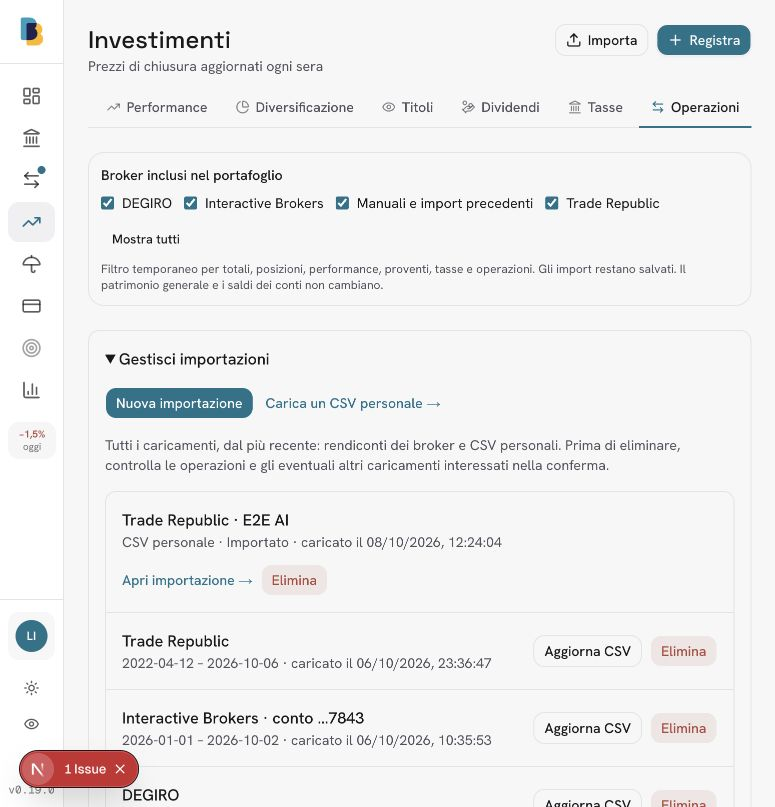
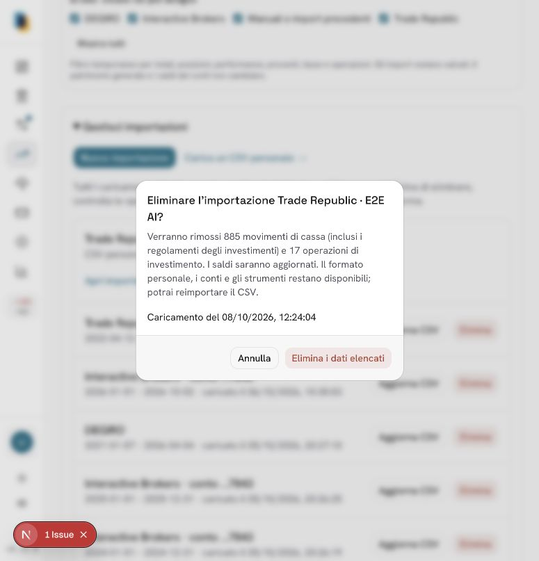
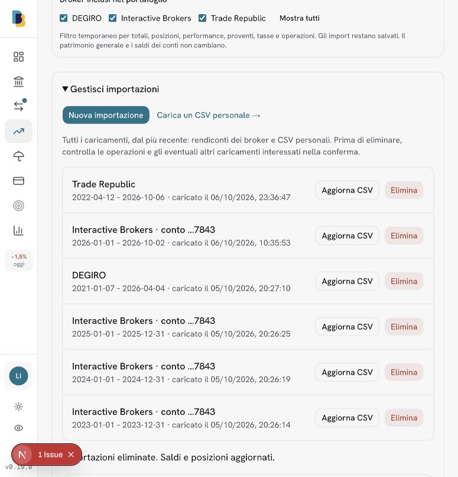

Lo stesso CSV è stato quindi ricaricato e confermato nuovamente usando il parser conservato. Un nuovo import cancellabile resta disponibile nell’account locale per la prova manuale.

### Filtro broker dopo la cancellazione

I conti vuoti conservati per reimportare non aggiungono più un broker al filtro: deve restare almeno un’operazione, un rendiconto o un saldo non nullo. Verificato dopo refresh completo: solo DEGIRO e Interactive Brokers, senza Trade Republic eliminato. Nove test filtro/liquidità passati, inclusi saldo negativo, rendiconto a saldo zero e operazioni ancora presenti; TypeScript ed ESLint passati.

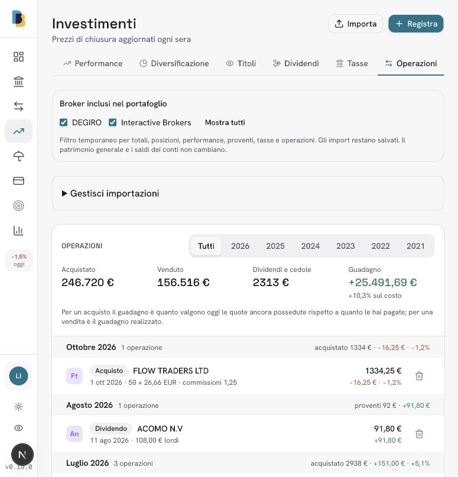

## File raw interpretato dall’AI

Rimosso il parsing CSV preliminare: l’input del modello contiene solo `rawCsv` (testo originale invariato) e `sourceName`. Nessuna ricerca di intestazioni, delimitatori o colonne, nessuna regola Bitpanda. Il parser generato interpreta il documento; i riferimenti alle righe servono all’anteprima e al controllo che ogni riga abbia un esito. Consenso aggiornato: anche dati personali nel file sono inclusi, con ZDR obbligatorio.

Prova reale dal browser con il file Bitpanda fornito dall’utente: il modello DeepSeek ha generato il parser in circa 24 secondi; **51 righe, 45 operazioni, 6 esclusioni motivate, nessun errore di parsing** (5 righe introduttive e 1 intestazione). Anteprima disponibile per la revisione dell’utente, nessuna conferma finanziaria eseguita. Questo verifica l’analisi del formato, non certifica la correttezza finanziaria del parser generato. Il file privato e il codice generato non sono inclusi nel repository.

27 test dedicati passati, inclusa verifica che il payload del modello sia esattamente il file raw e il nome della fonte; TypeScript ed ESLint passati.

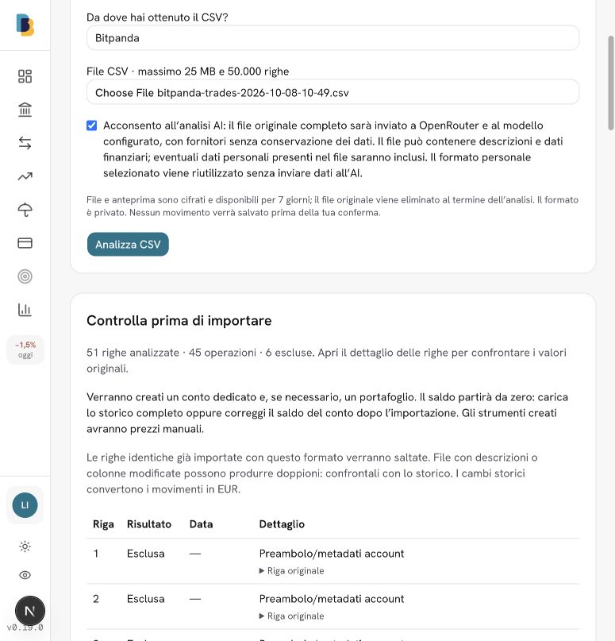
